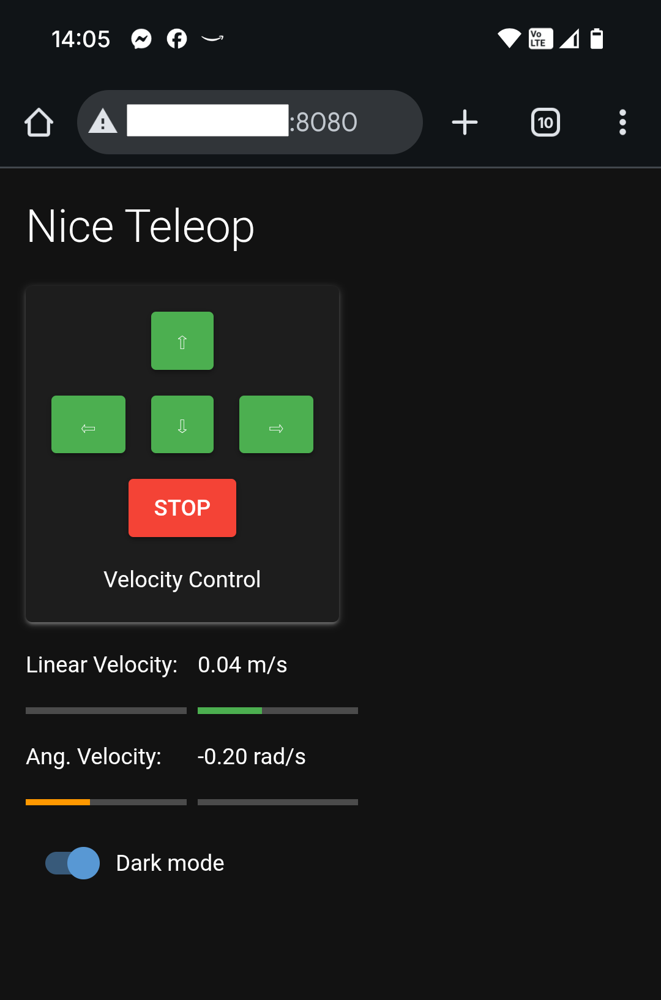

# dr_robot_tools

This repository is meant to collect multiple ROS2 packages that provide simple tools for interaction with mobile robots.

| Package               | Description                                                     | Notes            |
| --------------------- | --------------------------------------------------------------- | ---------------- |
| dr_simple_ui          | A web-based UI for teleoperation of mobile robots               |                  |
| dr_battery_monitor    | A customizable battery monitor that uses desktop notifications  | Work in progress |

<figure class="image">
  
  <figcaption>dr_simple_ui</figcaption>
</figure>