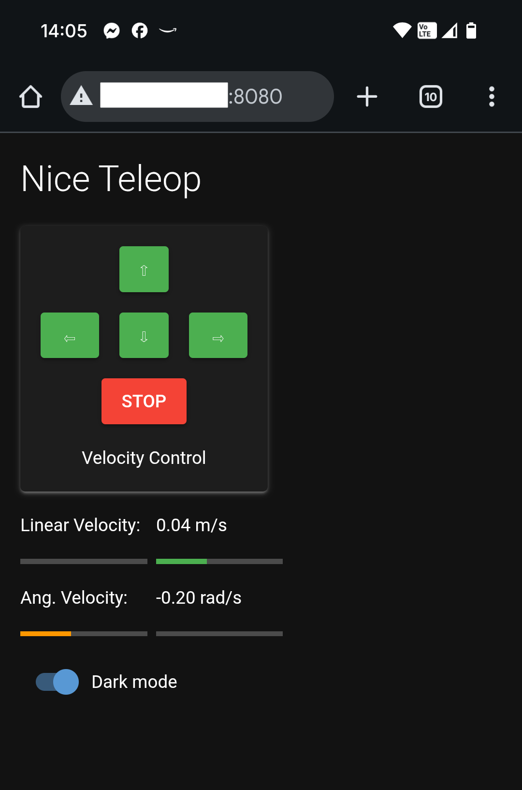

# dr_simple_ui

This package provides a simple web-based GUI intended for basic teleoperation of a robot. The idea behind it is the same as that of [teleop_twist_keyboard](https://index.ros.org/r/teleop_twist_keyboard/) or [turtlebot3_teleop](https://index.ros.org/p/turtlebot3_teleop/): A single press of a key-button increases or decreases the corresponding linear or angular component of a [TwistStamped](https://docs.ros2.org/foxy/api/geometry_msgs/msg/TwistStamped.html) message sent to the robot. The GUI is based on [NiceGUI](https://nicegui.io/) and ROS2.

## Prepare

- Create a virtual environment for the required Python dependencies, for example:
  - ``python3 -m venv ui_venv``
  - ``source ui_venv/bin/activate``
  - ``pip install -r ~/path_to_your_package/requirements.txt``
  - ``deactivate``

- Build the package
  - ``cd ~/path_to_your_workspace``
  - ``colcon build --packages-select dr_simple_ui --symlink-install``

- Make sure sourcing is done in order, for example:
  - ``source ui_venv/bin/activate``
  - ``source /opt/ros/jazzy/setup.bash``
  - ``source instal/setup.bash``

- If the venv is not part of your **PYTHONPATH**, add it accordingly, for example:
  - ``PYTHONPATH=~/ui_venv/lib/python3.12/site-packages/:${PYTHONPATH}``
  - ``export PYTHONPATH``

## Usage

- Run the UI:
  - ``ros2 run dr_simple_ui ui``
- Open it on a browser on any device on the same network. NiceGUI shows the URL on the terminal, but by default it should be your machine's address on port 8080.
- The UP- and DOWN-buttons control the linear component of the velocity commands, while the LEFT- and RIGHT-buttons are in charge of the angular velocity. The STOP-button will set the velocity to 0s, stopping thus the robot. 
- The current velocity is displayed in the lower part of the UI and is limited by ROS parameters.

### Parameters

| Parameter             | Description                                               |
| --------------------- | --------------------------------------------------------- |
| cmd_vel_topic         | The topic to send velocity commands to                    |
| max_angular_velocity  | Max. angular velocity allowed in both directions (rad/s)  |
| max_linear_velocity   | Max. linear velocity allowed in both directions (m/s)     |
| linear_velocity_step  | Increment in linear velocity per click (m/s)              |
| angular_velocity_step | Increment in angular velocity per click (rad/s)           |